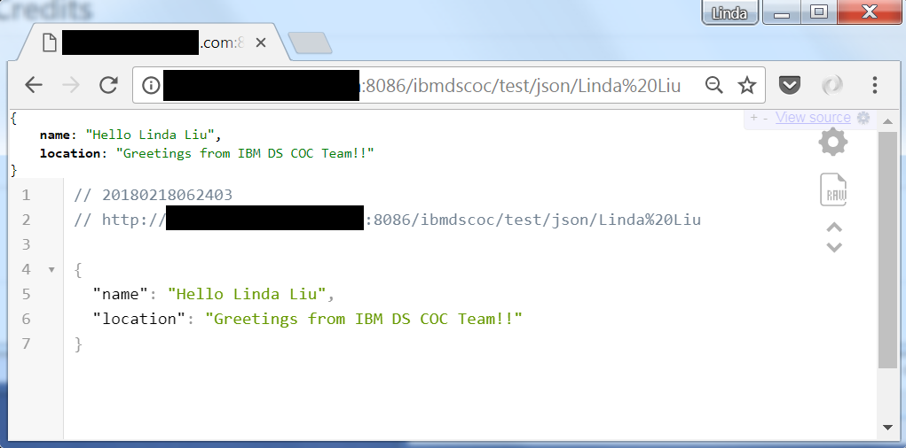
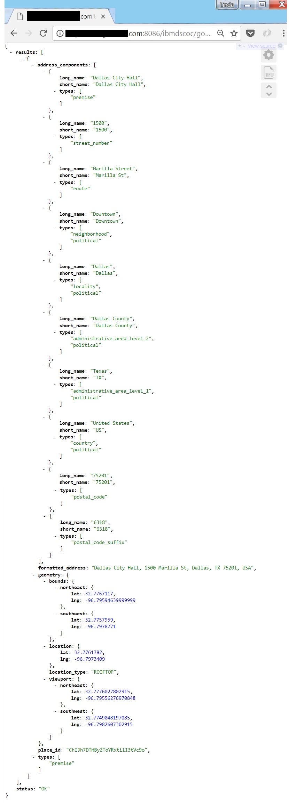

# GEO Serverless Restful Microservice #

This service is based on service-oriented architecture (SOA) design, which is purposely built as a small independent service and it runs by it's own without dependent on a web server or an application server platform (ie. Web container or JEE server). However, it does require Java v1.8 or above on the deployed server.

The code is designed using Java encapsulation so you can add a wrapper class for new or modified implementation. The fundation (ie. parent) class currently is calling Google Map API to standardize an address and the primary objective of this service is retrieve the latitude and longitude so we can use them in analytics type of applications. 

Currently after the built deployment package includes 62 jars and total size of ~10.5MB.


Thanks to the [Application Assembler Maven Plugin](http://www.mojohaus.org/appassembler/appassembler-maven-plugin/) a start.sh and a stop.sh script are available.


## Create the deployment package for any server (ie. Window, Linux) using Java JDK v1.8+ ##

### Pre-req (Mandatory) ###
1. JDK v1.8+
2. Google Developer API Key. You can get a Google Developer Acccount for free with limited API calls. https://developers.google.com/maps/documentation/javascript/get-api-key

### Build Deployment Package ###

```$ git clone git://github.ibm.com/DataScienceCoC/GeoService.git```

```$ cd GeoService```

```$ mvn clean install```

```$ chmod +x target/appassembler/bin/*```

## Start the serverless web service process from the deployed server ##

You can use any available start and end port on the deployed server.

Example below shows start on port 8086 and end on port 8087
``` $./target/appassembler/bin/start.sh 8086 8087 &```

## Stop the serverless web service process from the deployed server ##
``` ./target/appassembler/bin/stop.sh 8087```

## After Start script, the GEO Restful service can be called from any client application ##

### Following is a simple deployment test from a browser ###

Point to URL: 

  * [http://<Deployed_Server>:8086/ibmdscoc/test/json/Linda Liu] //You should see Hello Linda Liu in a JSON output
  
  * [http://<Deployed_Server>:8086/ibmdscoc/test/xml/Linda Liu] //You should see Hello Linda Liu in a XML output


## Example on using the Restful call ##

### Template ###

  * http://<Deployed_Server>:<port>/ibmdscoc/google/mapapi/<Map_API_End_Point>&<Geometry_API_End_Point>&<ADDRESS>&<TUNING_PARAMETER>&<GOOGLE_API_KEY>
  
### Description ###
  
  * You can ignore parameter #2 and #4. Just leave them empty
  
  * Parameter #1, 3, 5 are mandatory. Make sure your parameter value is URL encoded. Use your favorite language/script in your application to encode the parameter value when passing.
  
  * Example from an application call : http://localhost:1005/ibmdscoc/google/mapapi/https%3A%2F%2Fmaps.googleapis.com%2Fmaps%2Fapi%2Fgeocode%2Fjson%3Faddress%3D&&1500+MARILLA+ST%2C+DALLAS%2C+TX+75201&&<GOOGLE_API_KEY>
  
  * 
  * 

## Credits ##

  * Uses [Maven](http://maven.apache.org/) as a build tool
  * Uses [Maven Jetty plugin](https://github.com/eclipse/jetty.project) source code

## Note ##

  * Welcome your comment and improvement code.
  
